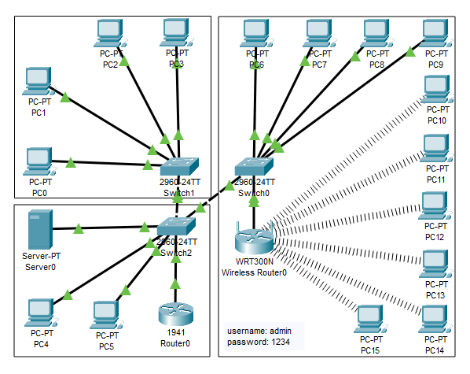

## Лабораторная работа 4

Вы сетевой и системный администратор. Вам поставлена задача разработать схему сети.

Дано 3 помещения в здании. В этих помещениях есть только голые стены и розетки. 

В сети должна быть реализована возможность связываться с любым из трёх помещений в здании, но при этом каждое помещение (отдел) должны быть изолированы.
Также в третьем помещении необходимо создать беспроводную точку доступа. Эта точка должна иметь пароль `itmo-uni2020`, должны автоматически выдаваться первые 20 адресов, *SSID* должен быть скрыт и иметь имя `room3`.

Во втором помещении находится *web сервер*. Его необходимо настроить. От Вас требуется реализовать в каждом помещении возможность получать доступ к серверу по *url* имени.

В первом помещении 4 рабочих места, во втором — 2 рабочих места и сервер, третье помещение нужно для гостевых работников (10 рабочих мест, в том числе 4 беспроводных).

К сетевому оборудованию вам необходимо предоставить безопасный удаленный доступ (*SSH*).
Обеспечить защиту портов доступа на коммутаторах (не более 2 адресов на интерфейсе, адреса должны быть динамически сохранены в текущей конфигурации, при попытке подключения устройства с адресом, нарушающим политику, на консоль должно быть выведено уведомление, порт должен быть отключен).

Вам необходимо создать административную виртуальную сеть и задать ей имя `Faculty-ICT`.

В наличии имеется:

- 3 коммутатора Cisco 2960;

- маршрутизатор Cisco 1941; 

- роутер Cisco WRT300N;

- 10 компьютеров с проводной сетевой картой;

- 6 компьютеров с WiFi сетевой картой.

Всю работу необходимо выполнить в бесплатной программе *Cisco Packet Tracer*.

*Hint!* В этом репозитории есть файл-заготовка - посмотрите его!

## Как сдать работу

Загрузить файл схемы, реализованной в *Cisco Packet Tracer* в этот репозиторий. 
Добавить в файл README.md скриншот схемы виртуальной сети.

<h1 align="center">Скриншот

## Дополнительные источники

* [Установка Cisco Packet Tracer](https://linuxhint.com/install_packet_tracer_ubuntu_1804/)

* [Видеоурок по Packet Tracer](https://youtu.be/VqMeJ-WH4E0)

* [Основные команды Cisco IOS](https://www.netwrix.com/cisco_commands_cheat_sheet.html)

* [Большая книга по настройке оборудования Cisco](https://www.cisco.com/c/en/us/td/docs/ios/fundamentals/command/reference/cf_book.pdf)
