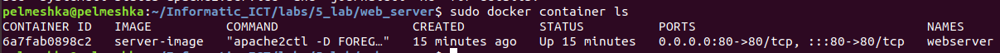
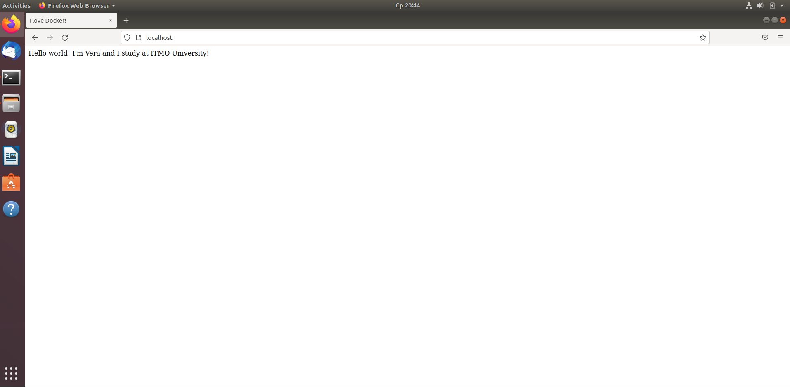
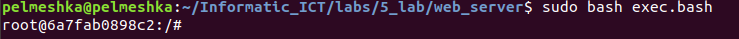
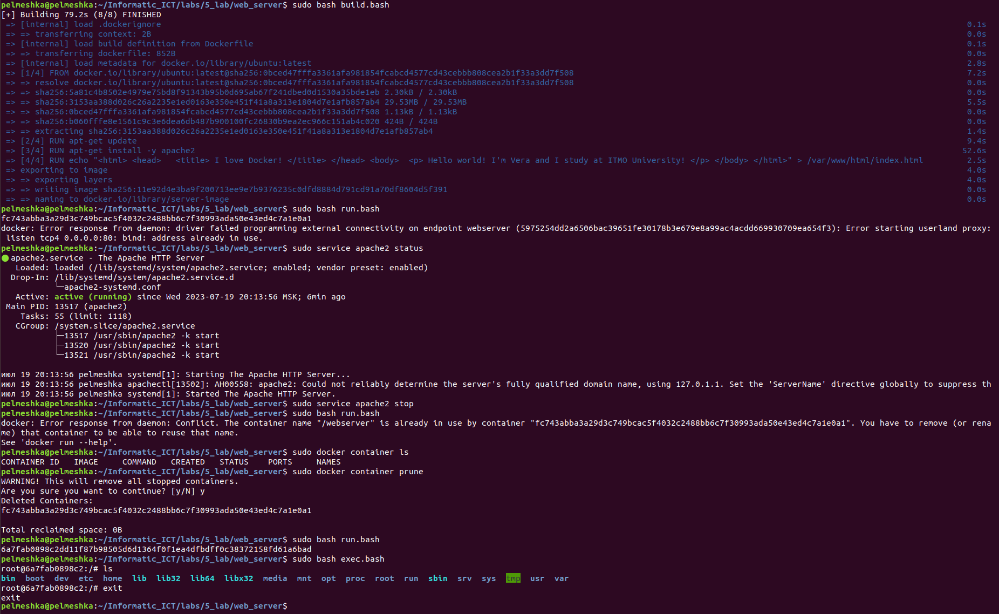

# Как запустить лабу?
1) Установите Docker и Apache, последовательно выполнив команды

```
sudo apt-get update
sudo apt-get install ca-certificates curl gnupg
sudo install -m 0755 -d /etc/apt/keyrings
curl -fsSL https://download.docker.com/linux/ubuntu/gpg | sudo gpg --dearmor -o /etc/apt/keyrings/docker.gpg
sudo chmod a+r /etc/apt/keyrings/docker.gpg
echo \
  "deb [arch="$(dpkg --print-architecture)" signed-by=/etc/apt/keyrings/docker.gpg] https://download.docker.com/linux/ubuntu \
  "$(. /etc/os-release && echo "$VERSION_CODENAME")" stable" | \
  sudo tee /etc/apt/sources.list.d/docker.list > /dev/null
sudo apt-get update
sudo apt-get install docker-ce docker-ce-cli containerd.io docker-buildx-plugin docker-compose-plugin
sudo apt update
sudo apt install apache2
```

2) Перейдите в папку, где лежит докерфайл и скрипты
3) Пропишите
```
sudo bash build.bash
```
4) Далее, если не возникло ошибок
```
sudo bash run.bash
```
__Возможные ошибки на данном этапе:__

- docker: Error response from daemon: driver failed programming external connectivity on endpoint webserver (5975254dd2a6506bac39651fe30178b3e679e8a99ac4acdd669930709ea654f3): Error starting userland proxy: listen tcp4 0.0.0.0:80: bind: address already in use.
- docker: Error response from daemon: Conflict. The container name "/webserver" is already in use by container "fc743abba3a29d3c749bcac5f4032c2488bb6c7f30993ada50e43ed4c7a1e0a1". You have to remove (or rename) that container to be able to reuse that name.
See 'docker run --help'.

__Решение:__
```
sudo service apache2 stop
sudo docker container prune
```
Если вторая ошибка не исчезает, то напишите команду:
```
sudo docker container ls
```

Появятся такие записи. Теперь необходимо прописать следующие команды:
```
sudo docker stop webserver
sudo docker rm webserver
```
где webserver это имя контейнера из NAMES.

После этого еще раз напишите:
```
sudo bash run.bash
```
5) Зайдите в браузер на виртуальной машине и наберите в поиске `localhost`. Должна появиться следующая страница:



6) Возвращается в терминал и прописываем:
```
sudo bash exec.bash
```


Чтобы выйти отсюда достаточно написать `exit`

Готово! Лаба сделана.

## Как это примерно выглядело у меня:


